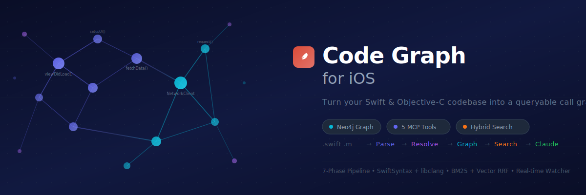

<p align="center">
  
</p>

<p align="center">
  <strong>Turn your Swift & Objective-C codebase into a queryable call graph</strong>
</p>

<p align="center">
  <a href="#quick-start-docker"></a>
  <a href="docs/operations-guide.md"></a>
  <a href="LICENSE"></a>
</p>

---

# Code Intelligence Graph

A code analysis system for iOS projects (Swift / Objective-C) that parses your codebase into a [Neo4j](https://neo4j.com/) graph database and exposes 5 MCP tools for Claude to query call chains, impact scopes, and semantic search.

```
Source Code (.swift / .m)
        ↓
  7-Phase Pipeline
  (Parse → Extract → Resolve → Community → Trace → BM25 → Embedding)
        ↓
   Neo4j Graph DB  (+ Vector Index)
        ↓
  FastAPI MCP Server
        ↓
 Claude (via MCP protocol)
```

## Features

- **7 MCP tools**: `call-chain`, `impact-scope`, `context`, `search`, `cypher`, `process-trace`, `list-functions`
- **Swift + ObjC parsing**: SwiftSyntax CLI (official Apple parser) + libclang, with regex fallback
- **Hybrid search (BM25 + vector)**: RRF fusion of BM25 keyword search and DashScope vector embeddings; gracefully degrades to BM25-only if no API key is set
- **Call graph visualization**: Interactive D3.js dashboard at `http://localhost:8080/dashboard`
- **Real-time updates**: File watcher triggers incremental rebuilds on save
- **Branch overlays**: Track separate graphs per git branch
- **IndexStore stub resolution** (optional): Resolves cross-file calls using Xcode's index

## Quick Start (Docker)

**Prerequisites**: Docker, Docker Compose, an iOS project built at least once in Xcode.

```bash
# 1. Clone the repo
git clone https://github.com/emao91495-pixe/code-graph-iOS.git
cd code-graph-iOS

# 2. Configure your workspace
cp .env.example .env
# Edit .env:
#   WORKSPACE_PATH=/absolute/path/to/your/ios/project   (required)
#   DASHSCOPE_API_KEY=sk-your-dashscope-api-key          (required, for hybrid search)

# 3. Generate a domain mapping (optional but recommended)
python scripts/generate_domain_mapping.py --workspace /path/to/your/ios/project

# 4. Start services
docker compose up -d

# 5. Build the graph (all 7 phases including embedding)
docker compose exec graph-api python cli.py build

# 6. Open the dashboard
open http://localhost:8080/dashboard
```

> **DashScope API Key**: Hybrid search (Phase 7) requires a DashScope API key. Get one at [https://dashscope.console.aliyun.com/](https://dashscope.console.aliyun.com/), then set `DASHSCOPE_API_KEY` in your `.env` file.

## Configure Claude Code (MCP)

Add to your `.claude/mcp_settings.json`:

```json
{
  "mcpServers": {
    "code-graph": {
      "command": "python",
      "args": ["/path/to/code-intelligence-graph/src/mcp/mcp_stdio.py"],
      "env": {}
    }
  }
}
```

Or, if using the HTTP server:

```json
{
  "mcpServers": {
    "code-graph": {
      "url": "http://localhost:8080"
    }
  }
}
```

## MCP Tools

| Tool | Description |
|---|---|
| `cig_search` | Natural language search over functions (BM25 + vector hybrid) |
| `cig_context` | 360° context: callers, callees, class, file, domain |
| `cig_impact` | Blast radius: all functions that (transitively) call this one |
| `cig_call_chain` | Forward call tree: what this function calls downstream |
| `cig_graph_stats` | Graph health: counts, coverage %, high-risk nodes |

See [docs/mcp-tools.md](docs/mcp-tools.md) for full input/output reference.

## Architecture

```
src/
  graph/         Neo4j schema + store (batch writes)
  parser/        Swift (SwiftSyntax CLI) + ObjC (libclang) parsers
  indexing/      6-phase pipeline orchestration
  query/         Query engine for all 7 MCP tools
  search/        BM25 index + vector embedding client + hybrid RRF search
  mcp/           FastAPI server + stdio MCP server
```

### 7-Phase Pipeline

| Phase | What it does |
|---|---|
| 1. Parse | Parse .swift / .m files into AST nodes |
| 2. Extract | Convert AST → (NodeRecord, EdgeRecord) pairs |
| 3. Import Resolve | Match unresolved CALLS edges to Function nodes |
| 4. Community Detect | Cluster functions by domain using Louvain algorithm |
| 5. Process Trace | Pre-compute execution flow paths |
| 6. BM25 Index | Build full-text keyword search index |
| 7. Embedding | Generate vector embeddings via DashScope (optional) |

## Configuration

Edit `config.yaml`:

```yaml
workspace:
  path: /path/to/your/ios/project   # REQUIRED

neo4j:
  uri: bolt://localhost:7687
  user: neo4j
  password: codegraph123

pipeline:
  max_workers: 4        # parallel parse workers
  max_file_size_kb: 300 # skip call extraction for large files

# Optional: enable hybrid search (BM25 + vector embedding)
embedding:
  model: qwen3-vl-embedding
  dims: 2560
  batch_size: 10
  # api_key: your-dashscope-api-key  (or set DASHSCOPE_API_KEY env var)
```

### Hybrid Search Setup

Search uses BM25 + vector embedding hybrid mode (RRF fusion). You need a DashScope API key for the full pipeline to work:

1. Get a DashScope API key at [https://dashscope.console.aliyun.com/](https://dashscope.console.aliyun.com/)
2. Set the key in `.env`: `DASHSCOPE_API_KEY=sk-your-key` (or in `config.yaml` under `embedding.api_key`, or as environment variable)
3. Build (or rebuild) the graph: `python cli.py build` — Phase 7 will generate embeddings automatically

See [docs/setup.md](docs/setup.md) for non-Docker installation and [docs/operations-guide.md](docs/operations-guide.md) for the full operations manual.

## Domain Mapping

Domains group functions by feature area (e.g. `networking`, `auth`, `ui`).
Generate a starter mapping automatically:

```bash
python scripts/generate_domain_mapping.py --workspace /path/to/ios
```

Then edit `domain_mapping.yaml` to fine-tune. See [docs/domain-mapping-guide.md](docs/domain-mapping-guide.md).

## CLI Reference

```bash
python cli.py build                          # Full build
python cli.py build --file MyFile.swift      # Incremental build
python cli.py query call-chain MyClass.foo   # Call chain
python cli.py query impact MyClass.foo       # Impact scope
python cli.py query context MyClass          # 360° context
python cli.py search "handle payment"        # BM25 search
python cli.py detect-changes --diff HEAD~1   # Git diff impact
python cli.py stats                          # Graph statistics
```

## IndexStore Stub Resolution (Advanced)

After building your project in Xcode, resolve additional cross-file call edges:

```bash
python scripts/resolve_stubs_indexstore.py --dry-run   # Preview
python scripts/resolve_stubs_indexstore.py             # Apply
```

See [docs/stub-resolution.md](docs/stub-resolution.md) for details.

## Requirements

- Python 3.12+
- Neo4j 5.x Community Edition
- macOS (for Swift parsing via SwiftSyntax CLI and libclang)
- Xcode 15+ (provides `libclang` and optionally `libIndexStore`)

## Documentation

| Document | Content |
|---|---|
| [Operations Guide](docs/operations-guide.md) | Full step-by-step manual: install, build, connect to Claude, daily workflow, troubleshooting |
| [Setup Guide](docs/setup.md) | Non-Docker installation on macOS / Linux |
| [MCP Tools Reference](docs/mcp-tools.md) | Input/output schemas for all 5 MCP tools |
| [Domain Mapping Guide](docs/domain-mapping-guide.md) | How to configure logical domain mapping |
| [Stub Resolution](docs/stub-resolution.md) | Advanced: IndexStore-based cross-file call resolution |

## License

MIT — see [LICENSE](LICENSE).
